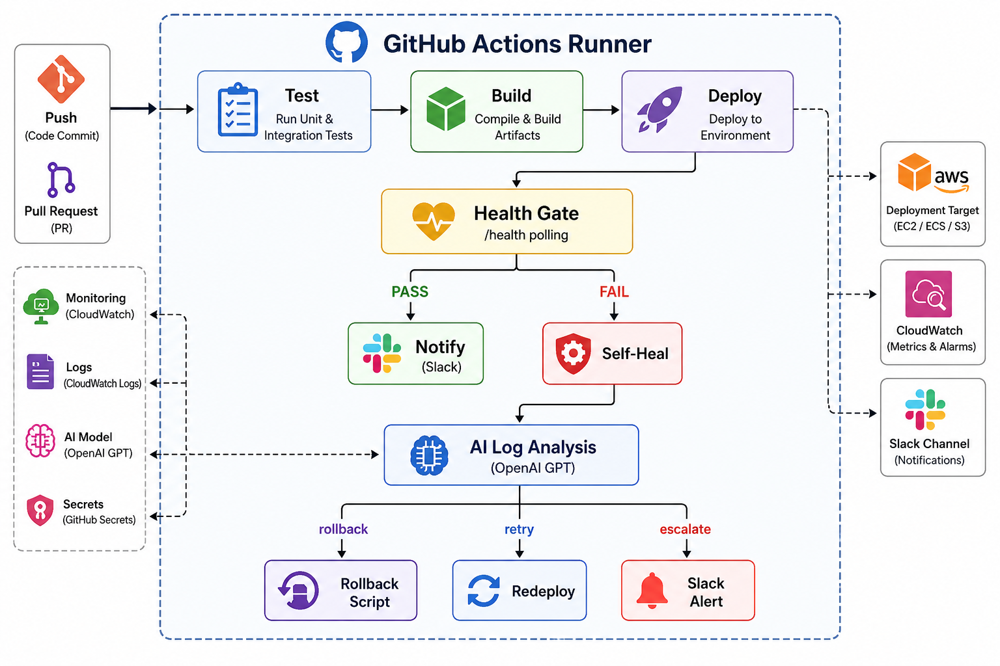

# Self-Healing CI/CD Pipeline

This project implements a self-healing CI/CD pipeline using GitHub Actions and AWS. After deployment, automated health checks verify the application. On failure, logs are analyzed using OpenAI, and the pipeline either retries deployment, performs a rollback, or sends a Slack alert based on the diagnosis.


## Architecture



---

## Features

- **Automated Health Checks** – Verifies application health after every deployment using the `/health` endpoint.
- **AI-Powered Log Analysis** – Uses OpenAI GPT to analyze deployment logs and identify the root cause of failures.
- **Automatic Rollback** – Restores the last stable deployment if the application fails health checks.
- **Smart Deployment Retry** – Retries deployments automatically when failures are identified as temporary.
- **Slack Notifications** – Sends real-time alerts for successful deployments, recovery actions, and failures.
- **Dockerized Application** – Runs the application in a secure Docker container with built-in health checks.
- **Prometheus Metrics** – Exposes a `/metrics` endpoint for monitoring with Prometheus and Grafana.
- **Automated Testing** – Runs unit tests with `pytest` and `pytest-cov` before deployment to ensure code quality.

---

## Project Structure

```
self-healing-cicd-pipeline/
├── .github/
│   └── workflows/
│       └── cicd.yml          
├── app/
│   ├── Dockerfile            
│   ├── main.py               
│   ├── requirements.txt      
│   └── templates/
│       └── index.html        
├── scripts/
│   ├── health_check.sh       
│   ├── log_analyzer.py       
│   └── rollback.sh           
├── tests/
│   └── test_app.py           
├── .gitignore
└── README.md
```

---

## Getting Started

### Prerequisites

- Python 3.11+
- Git
- Docker (optional, for container builds)
- An OpenAI API key

### Local Setup

```bash
git clone https://github.com/Yaseenkhan7/self-healing-cicd-pipeline.git
cd self-healing-cicd-pipeline

python -m venv .venv
source .venv/bin/activate          # Linux / macOS
# .venv\Scripts\activate           # Windows

pip install -r app/requirements.txt
```

### Running the Application

```bash
FLASK_ENV=development python app/main.py

```

Or with Docker:

```bash
docker build -t self-healing-demo ./app
docker run -p 5000:5000 \
  -e DEPLOYMENT_VERSION=1.0.0 \
  -e ENVIRONMENT=local \
  self-healing-demo
```

### Running Tests

```bash
pytest tests/ -v --cov=app --cov-report=term-missing
```

Expected output:

```
tests/test_app.py::TestIndexRoute::test_returns_200             PASSED
tests/test_app.py::TestHealthEndpoint::test_status_field_is_healthy PASSED
...
```

---

## CI/CD Pipeline

### Pipeline Stages

The pipeline defined in `.github/workflows/cicd.yml` runs on every push to `main` or `develop`:

### Self-Healing Flow

When `health-gate` fails, the `self-heal` job:

1. Downloads the deploy-log artifact produced by the `deploy` job.
2. Runs `scripts/log_analyzer.py` against the log.
3. Reads the `recommended_action` field from the JSON output:
   - **`rollback`** → runs `scripts/rollback.sh` to revert to `STABLE_VERSION`.
   - **`retry`** → re-launches the application and verifies health.
   - **`investigate` / `scale`** → logs the recommendation and sends a Slack escalation alert.

---

## AI Log Analysis

`scripts/log_analyzer.py` uses the OpenAI Chat Completions API with a carefully crafted system prompt to act as a senior SRE. It returns a structured JSON report:

```json
{
  "generated_at": "2024-11-15T10:32:00+00:00",
  "log_source": "deploy.log",
  "analysis": {
    "root_cause": "Container terminated due to OOM — RSS exceeded 512 MB limit.",
    "severity": "critical",
    "recommended_action": "rollback",
    "explanation": "The new build introduced a memory regression...",
    "remediation_steps": [
      "Roll back to the previous stable version immediately.",
      "Profile heap usage of the new build.",
      "..."
    ]
  }
}
```

When `OPENAI_API_KEY` is not set (or the API is unreachable), the script automatically falls back to a **pattern-matching heuristic engine** that covers the most common failure categories: OOM kills, connection-refused errors, and non-zero exit codes.

---

## Alerting

Slack notifications are sent at two points in the pipeline:

1. **End of pipeline** (`notify` job) — reports success, self-healing recovery, or unrecoverable failure.
2. **During rollback** (`rollback.sh`) — sends an alert when rollback starts and when it completes.

To enable Slack alerts, add your incoming-webhook URL as the `SLACK_WEBHOOK` secret. You can create a webhook at [api.slack.com/messaging/webhooks](https://api.slack.com/messaging/webhooks).

---

## Contributing

Pull requests are welcome! For significant changes, please open an issue first to discuss what you'd like to change.

1. Fork the repository
2. Create a feature branch (`git checkout -b feat/my-feature`)
3. Commit your changes (`git commit -m 'feat: add my feature'`)
4. Push to the branch (`git push origin feat/my-feature`)
5. Open a Pull Request

Please make sure tests pass before submitting (`pytest tests/ -v`).
